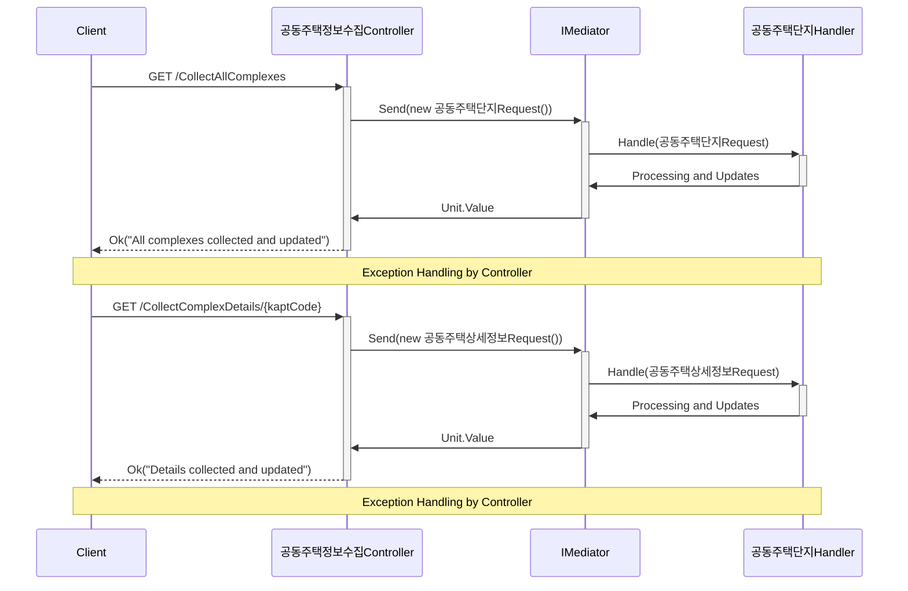
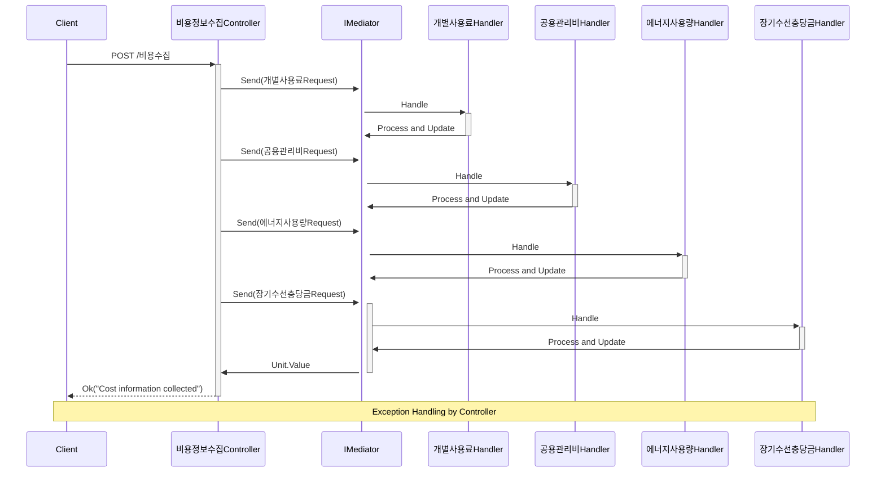
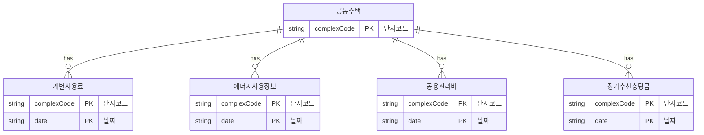
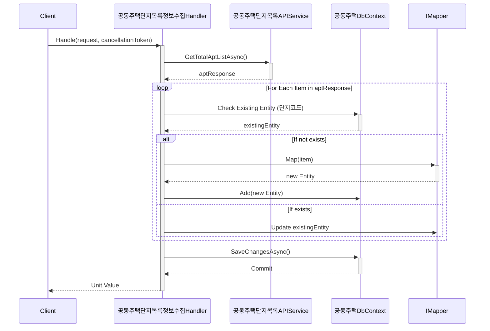

## Future Development

As we continue to develop and enhance our project, we are planning to integrate several new APIs from the Ministry of Land, Infrastructure and Transport to enrich our application. These APIs will provide extensive data and functionality related to communal housing management. Here is what we are planning to integrate:

### Planned API Integrations

- **국토교통부_공동주택 입찰결과공지 정보제공 서비스**: This service provides detailed information on the results of bidding for communal housing projects. [More Info](https://www.data.go.kr/data/15059177/openapi.do)

- **국토교통부_공동주택 입찰공고 정보제공 서비스**: This service announces bidding opportunities for communal housing, enabling stakeholders to participate in upcoming projects. [More Info](https://www.data.go.kr/data/15058166/openapi.do)

- **국토교통부_공동주택 유지관리 이력 정보제공 서비스**: This API will provide a comprehensive history of maintenance records for communal housing, enhancing our data analytics capabilities. [More Info](https://www.data.go.kr/data/15058045/openapi.do)

- **국토교통부_공동주택 수의계약 공지 정보제공 서비스**: This service publishes notices of negotiated contracts related to communal housing, providing transparency in contract awarding processes. [More Info](https://www.data.go.kr/data/15057758/openapi.do)

These integrations will allow us to offer more comprehensive services to our users and help communal housing administrators manage their properties more efficiently.

We are excited about the possibilities these new features will bring and we are eager to see how they will improve our service offerings. Stay tuned for updates as we progress in our development journey!

Stay tuned for updates as we progress. We value your feedback to help shape the future of our project!


<h2 align="center"><strong><span style="color:red;">공공데이터 링크 </span></strong></h2>


- [데이터 API 1 국토교통부_공동주택 기본 정보제공 서비스](https://www.data.go.kr/tcs/dss/selectApiDataDetailView.do?publicDataPk=15058453)
- [데이터 API 2 국토교통부_공동주택 단지 목록제공 서비스](https://www.data.go.kr/tcs/dss/selectApiDataDetailView.do?publicDataPk=15057332)
- [데이터 API 3 국토교통부_공동주택 에너지 사용 정보](https://www.data.go.kr/tcs/dss/selectApiDataDetailView.do?publicDataPk=15012964)
- [데이터 API 4 국토교통부_공동주택관리비(개별사용료)정보제공서비스](https://www.data.go.kr/data/15059469/openapi.do)
- [데이터 API 5 국토교통부_공동주택관리비(공용관리비)정보제공서비스](https://www.data.go.kr/data/15057937/openapi.do)
- [데이터 API 6 국토교통부_공동주택관리비(장기수선충당금)정보서비스](https://www.data.go.kr/tcs/dss/selectApiDataDetailView.do?publicDataPk=15059160)


<h2 align="center"><strong><span style="color:red;">프로세스</span></strong></h2>





<h2 align="center"><strong><span style="color:red;">ERD Example</span></strong></h2>



<h2 align="center"><strong><span style="color:red;">Handlr DFD Example</span></strong></h2>



# Configuration Settings

Below you will find a basic example of the necessary `appsettings.json` configuration for this project. Please make sure to adjust the settings according to your local environment and security requirements.

## Basic Configuration

```json
{
  "Logging": {
    "LogLevel": {
      "Default": "Information",
      "Microsoft.AspNetCore": "Warning"
    }
  },
  "ConnectionStrings": {
    "공동주택": "Server=localhost\\SQLEXPRESS01;Database=공동주택Db;Trusted_Connection=True;"
  },
   "공공데이터ServiceKey": "Your Service Key"
}

```
## Asp.net Core Service Container
```ServiceContainer
builder.Services.AddHttpClient();
builder.Services.AddDbContext<공동주택DbContext>(options =>
    options.UseInMemoryDatabase("공동주택Db"));
// Registering AutoMapper
builder.Services.AddAutoMapper(
    typeof(공동주택목록MappingProfile),

    typeof(가스사용료MappingProfile),
    typeof(건물보험료MappingProfile),
    typeof(급탕비MappingProfile),
    typeof(난방비MappingProfile),
    typeof(생활폐기물수수료MappingProfile),
    typeof(선거관리위원회운영비MappingProfile),
    typeof(수도료MappingProfile),
    typeof(입주자대표회의운영비MappingProfile),
    typeof(전기료MappingProfile),
    typeof(정화조오물수수료MappingProfile),

    typeof(공동주택기본정보MappingProfile),
    typeof(공동주택상세정보MappingProfile),

    typeof(경비비MappingProfile),
    typeof(교육훈련비MappingProfile),
    typeof(기타부대비용MappingProfile),
    typeof(소독비MappingProfile),
    typeof(수선비MappingProfile),
    typeof(승강기유지비MappingProfile),
    typeof(시설유지비MappingProfile),
    typeof(안전점검비MappingProfile),
    typeof(위탁관리수수료MappingProfile),
    typeof(인건비MappingProfile),
    typeof(재해예방비MappingProfile),
    typeof(제사무비MappingProfile),
    typeof(제세공과금MappingProfile),
    typeof(지능형홈네트워크설비유지비MappingProfile),
    typeof(차량유지비MappingProfile),
    typeof(청소비MappingProfile),
    typeof(피복비MappingProfile),

    typeof(단지별적립요율MappingProfile),
    typeof(단지별충당금잔액MappingProfile),
    typeof(단지별월부과액MappingProfile),
    typeof(단지별월사용액MappingProfile)
    );

builder.Services.AddMediatR(cfg => cfg.RegisterServicesFromAssembly(Assembly.GetExecutingAssembly()));

builder.Services.AddTransient<공동주택단지목록APIService>();
builder.Services.AddTransient<공동주택단지정보APIService>();
builder.Services.AddTransient<공동주택개별관리비APIService>();
builder.Services.AddTransient<공동주택공용관리비APIService>();
builder.Services.AddTransient<공동주택에너지사용정보APIService>();
builder.Services.AddTransient<공동주택장기수선충당금APIService>();
```
<h2 align="center"><strong><span style="color:red;">Dcinside GitHub 갤러리 연재글</span></strong></h2>
https://gall.dcinside.com/mgallery/board/view/?id=github&no=63328&exception_mode=recommend&page=1
https://gall.dcinside.com/mgallery/board/view/?id=github&no=63379&exception_mode=recommend&page=1
